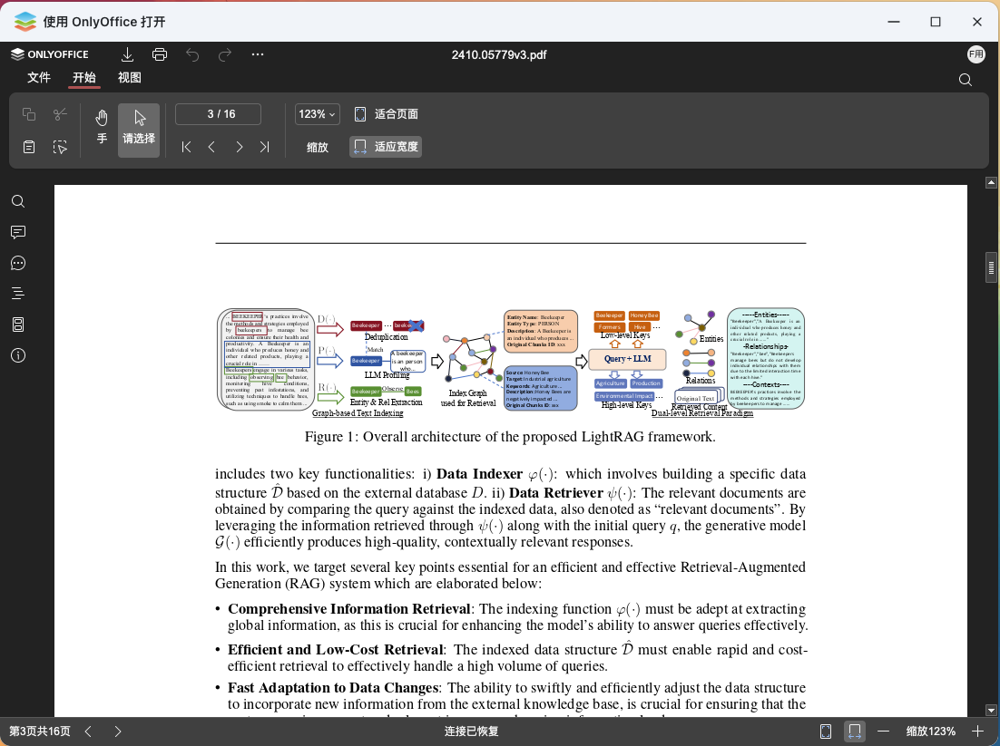

# 云豆豆编辑器 fnOS 连接器

在浏览器中直接编辑 NAS 上的 Office 文档。支持 DOCX、XLSX、PPTX 等格式的在线编辑，以及 DOC、XLS、PPT、ODT、ODS、ODP 等格式的转换和查看。

> ⚠️ **早期开发阶段**
> 
> 本应用仍处于非常早期的开发阶段，可能存在各种意料之外的 BUG。不同设备、不同客户端版本也可能产生不同的结果。**不建议在生产环境中使用**。



## 功能特性

- **在线编辑**: 直接在浏览器中编辑 DOCX、XLSX、PPTX 文档
- **格式转换**: 自动将旧格式 (DOC/XLS/PPT) 转换为 OOXML 格式
- **文档查看**: 支持 PDF、EPUB、FB2 等格式的在线预览
- **JWT 安全**: 支持 JWT 签名验证，确保文档传输安全
- **fnOS 集成**: 专为飞牛 NAS (fnOS) 设计的云豆豆编辑器连接器

## 支持的文件格式

| 类型 | 可编辑 | 可转换 | 仅查看 |
|------|--------|--------|--------|
| 文档 | docx | doc, odt, rtf, txt | pdf, djvu, epub, fb2 |
| 表格 | xlsx | xls, ods, csv | - |
| 演示 | pptx | ppt, odp | - |

## 安装部署

### 方式一：WatchCow + Docker Compose（推荐）

最灵活的部署方式，可随时调整配置和存储卷挂载。

进入 docker 目录，复制 `.env.example` 为 `.env` 并配置：

```bash
cd docker
cp .env.example .env
```

编辑 `.env` 文件：

```bash
# 外网域名后缀，用于判断是否走 HTTPS
# 匹配 *.example.com 和 example.com
EXTERNAL_DOMAIN=.your-domain.com

# JWT 密钥，用于 Document Server 安全通信
JWT_SECRET=your-secret-key-change-me
```

启动所有服务：

```bash
docker compose up -d
```

> ⚠️ **注意**：请根据你机器上的存储卷路径，修改 `compose.yaml` 中 `yundoudou-editor-connector` 的 volumes 挂载。默认配置为 `/vol1:/vol1` 等，需要改成你实际的存储路径。

这会启动三个容器：
- `yundoudou-editor-nginx`: 反向代理入口 (端口 9080)
- `yundoudou-editor-connector`: 云豆豆编辑器连接器服务
- `yundoudou-editor-doc-svr`: OnlyOffice Document Server

部署完成后，需要安装 [watchcow](https://github.com/tf4fun/watchcow) 来实现文件管理器右键菜单集成。

### 方式二：FPK 安装包

前往 [Releases](https://github.com/tf4fun/yundoudou-editor/releases) 页面下载最新的 `.fpk` 安装包，在 fnOS 应用中心选择「手动安装」上传即可。

> ⚠️ **FPK 包的局限性**
> 
> FPK 包本质上仍是基于 Docker 实现，只是提供了官方的安装引导流程。存在以下限制：
> 
> - **存储卷固定**：安装时会自动获取当前系统所有的 `/vol*` 存储卷，但无法处理后续增加或减少的存储卷
> - **无法重建容器**：fnOS 目前不支持重建应用容器以更新配置
> - **灵活性较低**：相比方式一，配置调整不够灵活
> 
> 如需更高的灵活性，建议使用方式一。

### 方式三：原生应用（开发中）

本应用涉及多个组件（nginx、connector、document server），网络拓扑较为复杂。原生部署方式仍在探索中，待简化后提供。

## 使用

部署完成后，在 fnOS 文件管理器中右键点击 Office 文档，选择「使用云豆豆编辑器打开」即可在浏览器中编辑。

## 配置说明

`.env` 文件中的配置项：

| 环境变量 | 说明 |
|---------|------|
| `EXTERNAL_DOMAIN` | 外网域名后缀，用于判断 HTTPS |
| `JWT_SECRET` | JWT 密钥，用于 Document Server 安全通信 |

## 项目结构

```
.
├── cmd/server/          # 主程序入口
├── docker/              # Docker 部署配置
│   ├── compose.yaml     # Docker Compose 编排文件
│   └── .env.example     # 环境变量示例
├── internal/
│   ├── config/          # 配置管理
│   ├── editor/          # 编辑器配置生成
│   ├── file/            # 文件服务
│   ├── format/          # 格式管理
│   ├── jwt/             # JWT 签名验证
│   └── server/          # HTTP 服务器
├── web/
│   ├── static/          # 静态资源
│   └── templates/       # HTML 模板
└── fpk_assets/          # fnOS 应用包资源
```

## 开发

```bash
# 编译
go build -o yundoudou-editor ./cmd/server

# 运行测试
go test ./...
```

## 许可证

MIT License

## 致谢

- [OnlyOffice Document Server](https://github.com/ONLYOFFICE/DocumentServer)
- [飞牛 NAS (fnOS)](https://www.fnnas.com/)
